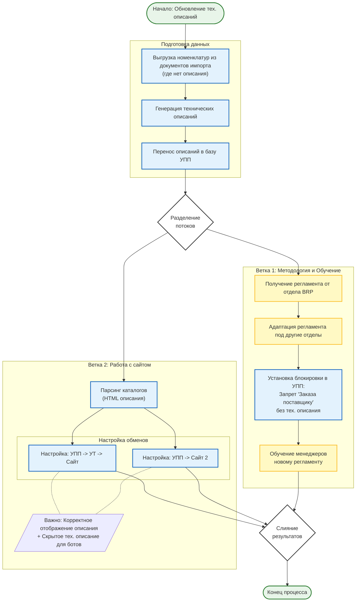

```mermaid
flowchart TD
    %% --- Стили ---
    classDef action fill:#e3f2fd,stroke:#1565c0,stroke-width:2px;
    classDef human fill:#fff9c4,stroke:#fbc02d,stroke-width:2px;
    classDef event fill:#e8f5e9,stroke:#2e7d32,stroke-width:2px,rx:5,ry:5;
    classDef gateway fill:#fff,stroke:#333,stroke-width:2px,rx:5,ry:5;

    %% --- Основной процесс ---
    Start(["Начало: Обновление тех. описаний"]):::event
    
    subgraph DataPrep [Подготовка данных]
        Step1["Выгрузка номенклатур из документов импорта<br/>(где нет описания)"]:::action
        Step2["Генерация технических описаний"]:::action
        Step3["Перенос описаний в базу УПП"]:::action
    end

    Fork{"Разделение<br/>потоков"}:::gateway

    %% --- Связи основного процесса ---
    Start --> Step1
    Step1 --> Step2
    Step2 --> Step3
    Step3 --> Fork

    %% --- Ветка 1: Методология и Обучение ---
    subgraph Branch1 [Ветка 1: Методология и Обучение]
        direction TB
        B1_Step1["Получение регламента от отдела BRP"]:::human
        B1_Step2["Адаптация регламента под другие отделы"]:::human
        B1_Step3["Установка блокировки в УПП:<br/>Запрет 'Заказа поставщику'<br/>без тех. описания"]:::action
        B1_Step4["Обучение менеджеров<br/>новому регламенту"]:::human
    end

    %% --- Ветка 2: Web и Интеграция ---
    subgraph Branch2 [Ветка 2: Работа с сайтом]
        direction TB
        B2_Step1["Парсинг каталогов<br/>(HTML описания)"]:::action
        
        subgraph Exchanges [Настройка обменов]
            B2_Step2["Настройка: УПП -> УТ -> Сайт"]:::action
            B2_Step3["Настройка: УПП -> Сайт 2"]:::action
        end
        
        NoteDisplay[/"Важно: Корректное отображение описания<br/>+ Скрытое тех. описание для ботов"/]
    end

    %% --- Связи веток ---
    Fork --> B1_Step1
    B1_Step1 --> B1_Step2
    B1_Step2 --> B1_Step3
    B1_Step3 --> B1_Step4

    Fork --> B2_Step1
    B2_Step1 --> B2_Step2
    B2_Step1 --> B2_Step3
    
    %% Привязка заметки
    B2_Step2 -.- NoteDisplay
    B2_Step3 -.- NoteDisplay

    %% --- Завершение ---
    Join{"Слияние<br/>результатов"}:::gateway
    End(["Конец процесса"]):::event

    B1_Step4 --> Join
    B2_Step2 --> Join
    B2_Step3 --> Join
    Join --> End
```
