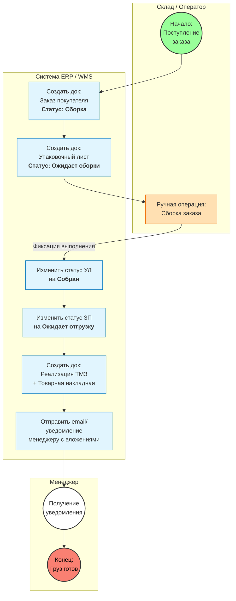

```mermaid
graph TD
    %% --- Определение дорожек (Swimlanes) ---
    
    subgraph Warehouse [Склад / Оператор]
        direction TB
        Start((Начало:<br>Поступление<br>заказа))
        Task_Assembly[Ручная операция:<br>Сборка заказа]
    end

    subgraph System [Система ERP / WMS]
        direction TB
        Create_SO[Создать док:<br>Заказ покупателя<br><b>Статус: Сборка</b>]
        Create_PL[Создать док:<br>Упаковочный лист<br><b>Статус: Ожидает сборки</b>]
        
        Update_PL_Status[Изменить статус УЛ<br>на <b>Собран</b>]
        Update_SO_Status[Изменить статус ЗП<br>на <b>Ожидает отгрузку</b>]
        
        Create_Final_Docs[Создать док:<br>Реализация ТМЗ<br>+ Товарная накладная]
        Notify_Manager[Отправить email/уведомление<br>менеджеру с вложениями]
    end

    subgraph Manager [Менеджер]
        direction TB
        Receive_Notify((Получение<br>уведомления))
        End((Конец:<br>Груз готов))
    end

    %% --- Связи (Логика процесса) ---

    %% 1. Инициализация
    Start --> Create_SO
    
    %% 2. Подготовка документов
    Create_SO --> Create_PL
    
    %% 3. Передача задачи на склад
    Create_PL --> Task_Assembly
    
    %% 4. Завершение сборки триггерит цепочку в Системе
    Task_Assembly -- Фиксация выполнения --> Update_PL_Status
    
    %% 5. Автоматическая цепочка статусов
    Update_PL_Status --> Update_SO_Status
    Update_SO_Status --> Create_Final_Docs
    
    %% 6. Уведомление
    Create_Final_Docs --> Notify_Manager
    Notify_Manager --> Receive_Notify
    Receive_Notify --> End

    %% --- Стилизация (делаем похоже на BPMN) ---
    style Start fill:#9f9,stroke:#333,stroke-width:2px,shape:circle
    style End fill:#fa8072,stroke:#333,stroke-width:2px,shape:circle,color:black
    style Receive_Notify fill:#fff,stroke:#333,stroke-width:2px,shape:circle
    
    %% Стили задач системы (автоматика - синий оттенок)
    style Create_SO fill:#e1f5fe,stroke:#0277bd
    style Create_PL fill:#e1f5fe,stroke:#0277bd
    style Update_PL_Status fill:#e1f5fe,stroke:#0277bd
    style Update_SO_Status fill:#e1f5fe,stroke:#0277bd
    style Create_Final_Docs fill:#e1f5fe,stroke:#0277bd
    style Notify_Manager fill:#e1f5fe,stroke:#0277bd

    %% Стили задач человека (оранжевый оттенок)
    style Task_Assembly fill:#ffe0b2,stroke:#ef6c00
```
